<picture>
  <source media="(prefers-color-scheme: dark)" srcset="assets/profile-dark.svg">
  <source media="(prefers-color-scheme: light)" srcset="assets/profile-light.svg">
  
</picture>

# 💻 Tech Stack:
                      

# 📊 GitHub Stats:
 
 

## 🏆 GitHub Trophies

---

